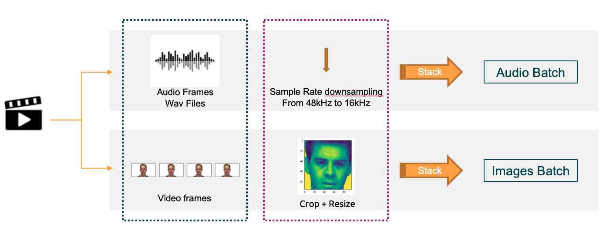
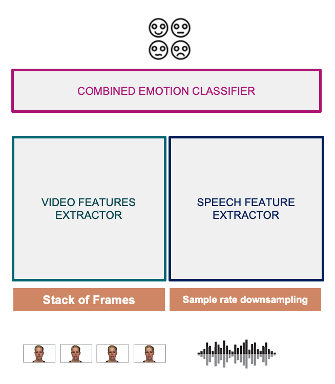
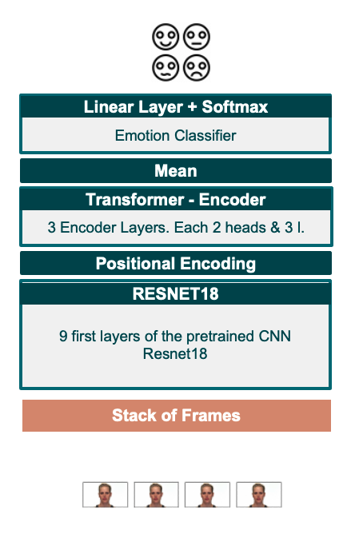
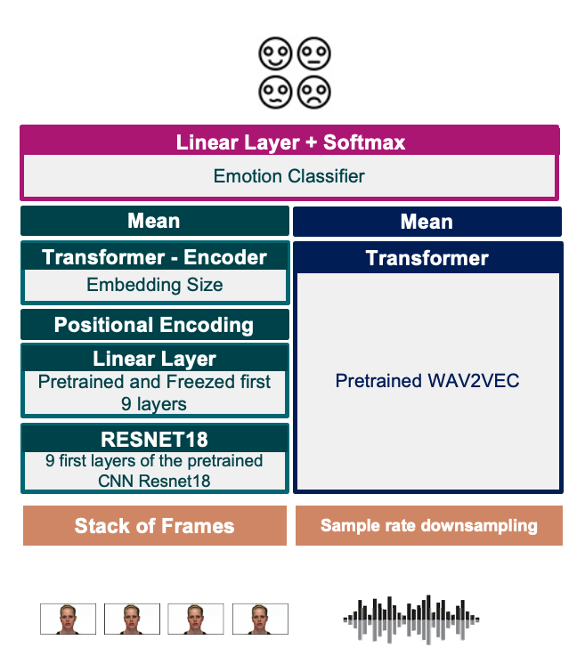

# MULTIMODAL SENTIMENT ANALYSIS
Final project for the 2022 Postgraduate course on Artificial Intelligence with Deep Learning, UPC School, authored by **Alex Romero Honrubia**, **Alexandra Abós Ortega**, **Oriol Algaba Birba** and **Laia Gasparin Pedraza**. 

Advised by **Gerard Gallego**.

Table of Contents
=================

  * [INTRODUCTION AND MOTIVATION](#introduction-and-motivation)
  * [DATASET](#dataset)
  * [ARCHITECTURE AND RESULTS](#architecture-and-results)
	 * [Video](#video-arch)
	 * [Audio](#i3d)
	 * [Multimodal](#multimodal-network)
  * [HOW TO TRAIN THE MODEL](#how-to-train-the-model)
  * [Setting the environment](#setting-the-environment)
  * [Running training scripts](#running-training-scripts)
  * [HOW TO RUN THE PROGRAM - video_processor](#how-to-run-the-program---video_processor)
  * [Installation](#installation)
	 * [Install Docker](#install-docker)
	 * [Install docker-compose](#install-docker-compose)
	 * [Create your .env file](#create-your-env-file)
	 *
  * [HOW TO RUN THE PROGRAMvideo_capture](#how-to-run-the-program)
---
---

## INTRODUCTION AND MOTIVATION
Video conferencing is experimenting a huge growth since the pandemic accross all industries. Video conferencing is now involving extra features as it is becoming the new working environment as well as new channel to consume professional services. A key point of the communication is the sentiment associated with the message. 

Nowadays, there are videoconferencing applications that transcript the conversations. This is useful for real-time consumption, i.e. better understanding of different accents,  as a support for deafs or for conversational voicebots. This is also useful for post-processing of the meeting, to extract notes or to analyze the conversation, i.e. recruiting interview. The transcript of a conversation would be much more complete if annotated with an emotion. 

Working, studying and sometimes meeting friends through the videoconferencing platforms made us think about this need. In addition, we were curious to learn how to combine video and audio in the same model and to deep dive on the transformer. 

## DATASET
The Ryerson Audio-Visual Database of Emotional Speech and Song ([RAVDESS](https://zenodo.org/record/1188976#.Yskil-xBxTY)) contains 7,356 files (total size: 24.8 GB). The database contains 24 professional actors (12 female, 12 male), vocalizing two lexically-matched statements in a neutral North American accent. Speech includes calm, happy, sad, angry, fearful, surprise, and disgust expressions. Each expression is produced at two levels of emotional intensity (normal, strong), with an additional neutral expression. All conditions are available in three modality formats: Audio-only, Audio-Video (720p H.264, AAC 48kHz, .mp4), and Video-only. For this project, we've only considered the Audio-Video and with speech, excluding the song videos. Files named: "Video_Speech_XX.zip", one per actor. 

Videos are recorded in a controlled environment ensuring a clear audio with no background noise and good pronunciation, and with a clear image. The person is static, always looking at the camera and with a white background. The image frames only the bust and the actors do not wear any accessory in the head, neck or ears. It is a very clean context to study the model only focusing on the audio and video information that matters without troubleshooting the cancellation of distorsions. 

Each video of our interest,  has the following metadata:
```
   {'filename': '01-01-03-02-02-02-06.mp4', 'modality': '01', 'emotion': '03', 'em_intensity': '02', 'statement': '02'}
```
The filename can directly be used to extract the data labels by parsing the third index. 

As the goal of the project is to detect basic emotions, we reduced the number of classes. Dataset is annotated with: neutral, calm, happy, sad, angry, fearful, surprise, and disgust. Our classifier only aggregates them in the following emotions: sad, happy, disgust and angry. This decision was made after not getting good results with the video model. There are emotions that were easily interchanged such as happy and surprised.  

The video files are read to extract the video and audio frames. The dimension of the video frames are: C, H, W = 3, 720, 1280. All video frames are stacked in one tensor in the Dataset class and retrieved as a batch of images. This allows the model to treat it as a sequence of images with Conv2D. 

Video frames are preprocessed. As the images only consider the bust and are always in the same position, we do a Center Crop to remove the white space and then resize the outcome. Afterwards, for the Dataloader, we've implemented a collate function to ensure the length of the video sequence is always the same by adding padding. This collate function also returns the mask so that the transformer Attention can discard those.


## ARCHITECTURE AND RESULTS
Our solution categorizes emotions based on audio and video. Each modality goes through its own unimodal-branch and the outputs are connected to get the emotion category out of a Classification layer. 
Our development approach was. First starting with the audio and video independently to achieve as unimodal. 


When the model was fine tuned and it worked with an acceptable performance, we worked on combining both models. 



In the following sections we will go through each of it.
### Video Model
The model to extract the features from the video frames is a combination of:
 * ResNet-18: A sequence of the first 9 Convolutional Neural Network Layers of the pretrained ResNet-18. Only the first 9 layers were used to get the low-level features. 
 * Positional Encoder: As a previous step for the Transfomer to know the frames order. 
 * Transformer Encoder: 3 Encoder Layers. Each Encoder layer with 3 layers and two-head attention block. 
 * Mean normalization: Before going into the classifier, the representation of the video frames are normalized with mean 1. 
 * Fully Connected Layer: the Linear layer as a Classifier.
 * Softmax: to get the output in probabilies of each emotion class.





### Audio Model
The model to extract the features from the audio is a combination of:
 * Wav2Vec: A pretrained model 


### Multimodal - Audio-Visual Emotion Classifier 


## How to Train the Model

## Settting the environment

python3 -m venv .venv
source .venv/bin/activate
pip install -r requirements.txt


